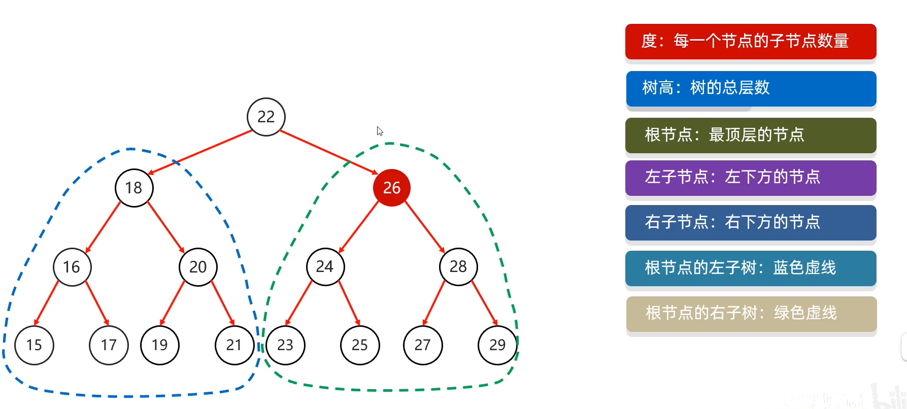

# 数据结构

## 二叉树

+ 节点的内部结构

  

+ 

## 平衡二叉树

+ 规则：任意节点左右子树不超过一
+ 平衡二叉树的旋转机制
  + 左旋
  + 右旋

## 红黑树

+ 红黑树是一种自平衡的二叉查找树，是计算机科学中用到的一种数据结构。
+ 1972年出现，当时被称之为平衡二叉B树。后来，1978年被修改为如今的"红黑树"。
+ 它是一种特殊的二叉查找树，红黑树的每一个节点上都有存储位表示节点的颜色，
+ 每一个节点可以是红或者黑;红黑树不是高度平衡的，它的平衡是通过"红黑规则"进行实现的

## 红黑规则

+ 每一个节点或是红色的，或者是黑色的
+ 根节点必须是黑色
+ 如果一个节点没有子节点或者父节点，则该节点相应的指针属性值为Nil，这些Nil视为叶节点，每个叶节点(Nil)是黑色的
+ 如果某一个节点是红色，那么它的子节点必须是黑色(不能出现两个红色节点相连的情况)
+ 对每一个节点，从该节点到其所有后代叶节点的简单路径上，均包含相同数目的黑色节点;

+ 红黑树添加节点的规则：
  + 添加节点默认是红色(效率高)
  + 

**更多内容请见 :point_right:[链接](https://flowus.cn/czlifetime/4fe006af-a7d0-4ef3-94b9-09f775b9334d)**

